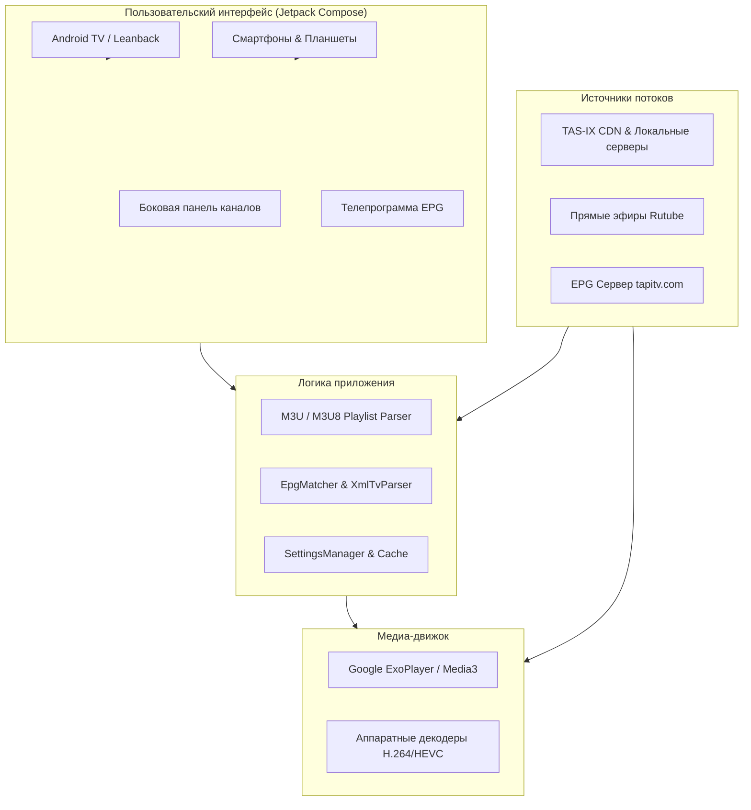

<div align="center">


# StreamVerse — Android IPTV Player (TAS-IX)

**Быстрый, легковесный и современный IPTV-плеер для Android TV, ТВ-приставок и смартфонов с поддержкой внутренних потоков TAS-IX (Узбекистан), Rutube и программы передач EPG (XMLTV).**

[](https://github.com/multizero88/android-iptv-tas-ix-work-app/releases/latest)
[](https://github.com/multizero88/android-iptv-tas-ix-work-app)
[](https://github.com/androidx/media)
[](https://developer.android.com/jetpack/compose)
[](https://github.com/multizero88/android-iptv-tas-ix-work-app)
[](LICENSE)

<br/>

[📥 **Скачать актуальную версию StreamVerse APK (v1.0.0)**](https://github.com/multizero88/android-iptv-tas-ix-work-app/releases/download/v1.0.0/StreamVerse-v1.0.0.apk)

<br/>

</div>

---

## 📖 О проекте

**StreamVerse** разработан для комфортного и стабильного просмотра телеканалов высокой четкости (HD / Full HD) на экранах любого размера — от смартфонов и планшетов до широкоформатных Android TV и ТВ-боксов (Xiaomi Mi Box, Mecool, Tanix, Ugoos и др.).

Главная особенность приложения — полная оптимизация под узбекский сетевой сегмент **TAS-IX**:
- **0 МБ расхода внешнего трафика** у большинства интернет-провайдеров Узбекистана (Uztelecom, Sarkor, TPS, Beeline, Ucell, Mobiuz и др.).
- **Минимальный пинг и отсутствие буферизации** благодаря локальным CDN-серверам и прямым трансляциям с Rutube.
- **Преднастроенный плейлист** с российскими, зарубежными и локальными каналами с постоянным обновлением.

---

## ✨ Ключевые возможности

- 📺 **Интерфейс для ТВ (Leanback & Android TV)**:
  - Удобная плиточная сетка каналов, оптимизированная для управления обычным пультом ДУ (D-Pad).
  - Быстрое контекстное меню и боковая шторка переключения каналов без прерывания текущего эфира.
- ⚡ **Оптимизация под TAS-IX и Rutube**:
  - Быстрая загрузка потоков из внутренней зоны без зарубежного трафика.
  - Поддержка HLS (.m3u8), MPEG-TS, MP4 и адаптивного битрейта (ABR).
- 📋 **Встроенная программа передач EPG (XMLTV)**:
  - Автоматическая синхронизация программы передач через XMLTV (`tapitv.com`).
  - Умный алгоритм **EpgMatcher**: точное сопоставление телепрограммы с каналами по названию и `tvg-id`.
  - Индикатор текущей передачи и времени до конца эфира.
- 🎬 **Ядро плеера Google ExoPlayer / Media3**:
  - Аппаратное ускорение декодирования видео (H.264, H.265 / HEVC).
  - Сверхбыстрое переключение между каналами (Fast Channel Switching).
  - Настройка масштабирования и соотношения сторон (16:9, 4:3, Zoom, Stretch).
- 🔀 **Альтернативные источники вещания**:
  - При возникновении проблем с основным потоком доступно мгновенное переключение на зеркало или резервный стрим.
- ⭐ **Избранное и история**:
  - Добавляйте любимые телеканалы в раздел «Избранное» одним нажатием.
  - История последних просмотров и умная сортировка по частоте включений.

---

## 🏗️ Архитектура приложения



---

## 📲 Установка

### Вариант 1. Установка на Android TV / ТВ-приставку (Рекомендуется)
1. Установите на телевизор бесплатное приложение **Downloader** из Google Play Store.
2. Откройте Downloader и введите прямую ссылку на APK-файл:
   ```text
   https://github.com/multizero88/android-iptv-tas-ix-work-app/releases/download/v1.0.0/StreamVerse-v1.0.0.apk
   ```
3. Скачайте файл и нажмите **Install**. При необходимости разрешите установку из неизвестных источников в настройках безопасности Android TV.

> 💡 **Альтернатива через USB**: Скачайте APK на компьютере, скопируйте на USB-флешку, подключите её к телевизору и запустите файл через любой файловый менеджер (например, *X-plore* или *FX File Explorer*).

---

### Вариант 2. Установка на Android смартфон или планшет
1. Откройте страницу релизов [Releases](https://github.com/multizero88/android-iptv-tas-ix-work-app/releases/latest) в браузере смартфона.
2. Скачайте файл **`StreamVerse-v1.0.0.apk`**.
3. Запустите загруженный файл и подтвердите установку.

---

### Вариант 3. Установка через ADB (для разработчиков и энтузиастов)
Подключите устройство по USB или Wi-Fi и выполните:
```bash
adb install -r StreamVerse-v1.0.0.apk
```

---

## 🎮 Управление с пульта (Android TV)

| Кнопка пульта | Действие |
|:---:|:---|
| **OK / Выбор** | Воспроизвести выбранный канал / показать интерфейс |
| **Вверх / Вниз** | Переключение на предыдущий / следующий канал |
| **Влево / Вправо** | Вызов боковой панели каналов / быстрая навигация |
| **Долгое нажатие OK** | Меню канала (выбор альтернативного потока, пропорции экрана) |
| **Назад (Back)** | Скрыть меню / Выход из приложения |

---

## 📡 Плейлисты и источники

По умолчанию приложение использует актуальный плейлист с поддержкой TAS-IX и Rutube:
- **Плейлист:** [`https://raw.githubusercontent.com/multizero88/uzpc/refs/heads/main/done.m3u`](https://raw.githubusercontent.com/multizero88/uzpc/refs/heads/main/done.m3u)
- **Телепрограмма (EPG):** `http://tapitv.com/ttv.xmltv.xml.gz`

Вы также можете использовать собственные плейлисты в формате `.m3u` или `.m3u8`.

---

## 🛠️ Стек технологий

- **Язык разработки:** [Kotlin](https://kotlinlang.org/)
- **UI Framework:** [Jetpack Compose](https://developer.android.com/jetpack/compose) & Leanback
- **Медиа-плеер:** [AndroidX Media3 / ExoPlayer](https://developer.android.com/media/media3)
- **Сетевой стек:** [OkHttp 4](https://square.github.io/okhttp/) & Kotlin Coroutines
- **Парсинг:** XMLPullParser (XMLTV EPG) & Fast M3U Parser
- **Минимальная версия ОС:** Android 7.0 (API 24)

---

## 📄 Лицензия

Проект распространяется под лицензией [MIT](LICENSE).

---

<div align="center">
  <sub>Разработано для сообщества пользователей Android TV и TAS-IX в Узбекистане.</sub>
</div>
